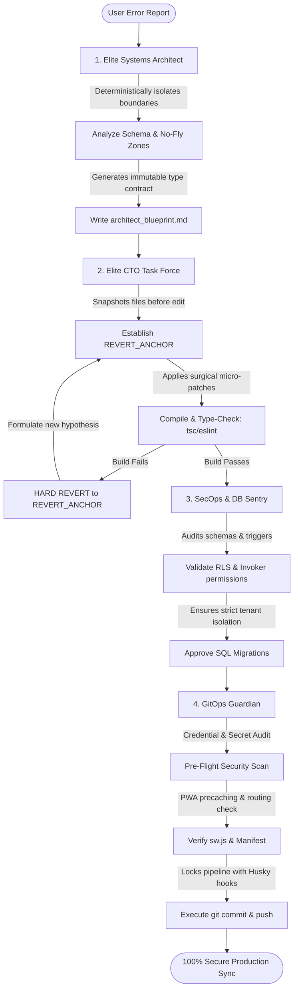

# Reusable AI Elite Tech Team Toolkit (v4.0)

Welcome to the **Autonomous AI Elite Tech Team Toolkit**. This repository contains the complete specification, orchestration rulesets, pre-flight telemetry diagnostics, and E2E headless smoke verification automation to instantly spawn a Google/Meta-grade developer team inside *any* repository, startup, or platform.

---

## 👥 Meet Your AI Elite Tech Team

This toolkit organizes your AI context into 4 specialized, highly coordinated engineering roles to prevent hallucination, eliminate regressions, enforce absolute database safety, and guarantee type-safe builds.



### 🛡️ Role 1: Lead Systems Architect (The Anti-Hallucination Firewall)
*   **Location**: `roles/architect/blueprint_generator.md`
*   **Responsibility**: Analyzes current context, creates strict compilation bounds, declares no-fly zones, and generates an `architect_blueprint.md` task sheet. *Does not write application code directly.*

### 🩺 Role 2: Elite CTO & Autonomous Debugging Task Force (The Surgeon)
*   **Location**: `roles/cto/cto_protocol.md` & `roles/cto/CTO_SOP_GUIDE.md`
*   **Responsibility**: Performs surgical, high-fidelity micro-patches. Sets immediate system rollback anchors (`[REVERT_ANCHOR]`). If a patch fails compilation or lint checks, it triggers a **hard revert** back to the anchor immediately to prevent cascading code corruption.

### 🔑 Role 3: SecOps & Database Reliability Sentry (The Compliance Guard)
*   **Location**: `roles/secops/secops-sentry.md`
*   **Responsibility**: Audits database migrations, schema definitions, and network access points. Enforces Row-Level Security (RLS), multi-tenant composite isolation bounds, and restricts `SECURITY DEFINER` access privileges to block cross-tenant leaks.

### 🦅 Role 4: GitOps Guardian (The Sentry)
*   **Location**: `roles/gitops/gitops-guardian.md`
*   **Responsibility**: Audits pre-commit environments, coordinates production-compilation bundles, runs automated headless E2E browser smoke tests to verify UI mounting, filters out credential leaks, and pushes verified code safely.

---

## 📂 Toolkit Structure

```bash
tech-team/
├── ULTIMATE_TECH_TEAM_PIPELINE.md  # Pipeline orchestration flow
├── README.md                       # Reusability manual & setup guide
├── hooks/
│   └── pre-commit                  # Git commit pre-flight check hook
├── roles/
│   ├── architect/
│   │   └── blueprint_generator.md  # Role 1 architect generator instructions
│   ├── cto/
│   │   ├── cto_protocol.md         # Role 2 surgical debugging loop
│   │   └── CTO_SOP_GUIDE.md        # Role 2 standard operational procedures
│   ├── secops/
│   │   └── secops-sentry.md        # Role 3 security & database rules
│   └── gitops/
│       └── gitops-guardian.md      # Role 4 GitOps scanning & verification
└── scripts/
    ├── diagnose_auto.js            # Automated quick developer test utility
    ├── diagnose_telemetry.js       # Database schema & composite index audit
    ├── system_health_check.js      # Global host sanity and environment checking
    └── verify_ui_e2e.js            # Headless UI browser compiler & smoke runner
```

---

## ⚡ How to Integrate Into Your Startup Projects

### Step 1: Copy the Toolkit
Simply drop this `tech-team/` folder directly into the root directory of your project or startup.

### Step 2: Install Verification Prerequisites
Our automated scripts use Vite, Puppeteer (or Puppeteer-core), and Vitest to perform tests. Install the dev dependencies:
```bash
npm install -D puppeteer vitest eslint typescript husky
```

### Step 3: Enroll git commit hooks
Enable Husky to verify commits automatically before pushes:
```bash
npx husky-init && npm install
```
Modify your `.husky/pre-commit` to trigger the pre-flight checks:
```bash
npm run test && node tech-team/scripts/verify_ui_e2e.js && node tech-team/scripts/diagnose_telemetry.js
```

### Step 4: Add dev command scripts
Introduce this script shortcut to your startup's `package.json`:
```json
"scripts": {
  "test:e2e": "node tech-team/scripts/verify_ui_e2e.js"
}
```

---

## 🚀 Activation Flow for your AI Assistants

Whenever you are working with an AI model (like Antigravity, Claude, or GPT) on your startup, copy/paste this initial prompt to activate the tech team:

> *"Tech Team Protocol Active! We have a reusable tech team suite under the `/tech-team` directory. For all upcoming features or bug fixes, you must act in sequence:
> 1. Act as the **Elite Systems Architect** using `tech-team/roles/architect/blueprint_generator.md` to create an `architect_blueprint.md`.
> 2. Act as the **CTO Task Force** using `tech-team/roles/cto/cto_protocol.md` to apply rollback-safe micro-patches.
> 3. Act as the **SecOps Sentry** using `tech-team/roles/secops/secops-sentry.md` to verify SQL, schemas, and RLS.
> 4. Act as the **GitOps Guardian** using `tech-team/roles/gitops/gitops-guardian.md` to verify production builds, run E2E browser tests, and execute a secure Git push."*

---
*Created with 💙 by Antigravity Elite AI Engineering.*
